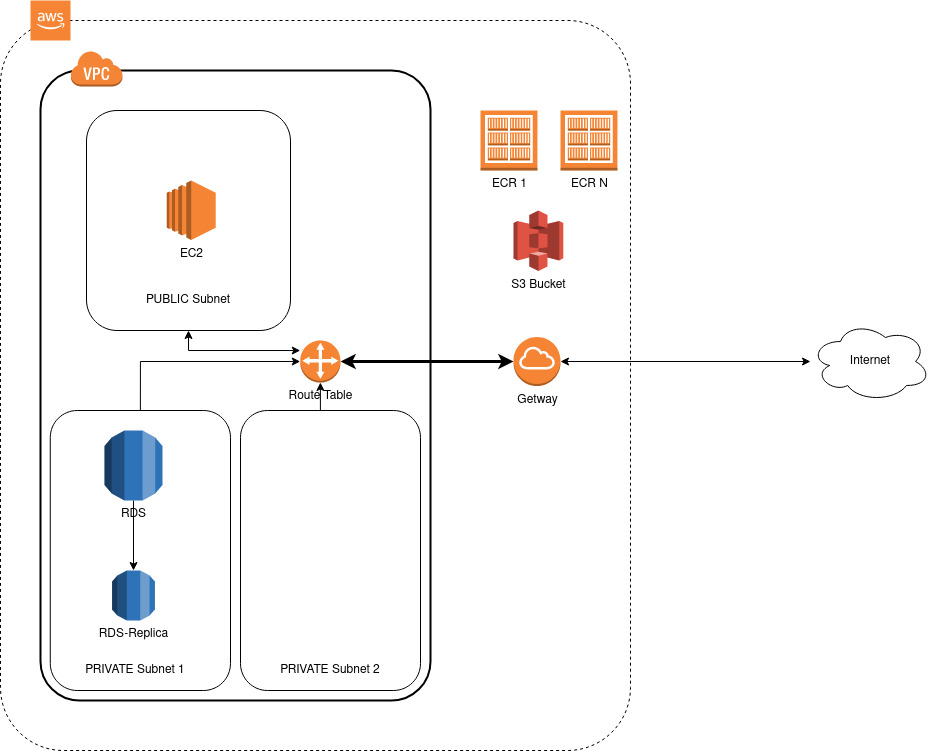

# Terraform Basic Infra

Developed by [Xmartlabs](https://xmartlabs.com/).

The objective of this repository is to provide a basic infrastructure template written in Terraform to create and manage 
AWS resources programmatically.

The AWS resources available in this repository are:
- Networking resources.
- EC2 instance.
- RDS instance for the database.
- S3 bucket.
- Optionally, you can configure also Cloudwatch, AWS SES and ECR.

A graphic representation of it ie the following diagram:


  
## Structure of the project

- `environments`: a folder that contains the `tfvars` files with the values of the variables for each environment.
- `modules`: a folder that contains the module definitions used in the template. The available modules are:
  - `module-cloudwatch`: Module that creates a clodwatch log_group and an IAM instance profile with access to it.
  - `module-ec2-linux-web`: Module that creates an EC2 instance 
  - `module-network-linux-web`: Module that creates all the networking resources required to deploy infrastructure with a single EC2 machine with exposition to the internet. The created resources include:
    - A vpc
    - A public subnet
    - A security group with the rules to open ports 443, 80 and 22 to the whole world
    - The API gateway and the route tables required to expose the previous subnet to the internet
  - `module-network-linux-web-db`: Module that creates the same resources that the previous module (`module-network-linux-web`) adding a connection between the database and the EC2 instance. That means:
    - 2 private subnets that are required to create the RDS instance
    - A db security group exposing the db port to the VPC cidr
  - `module-ecr`: Module that creates a set of Elastic container Registers (ECRs) useful for docker images storage
  -  `module-rd-db`: Module that creates a database in RDS. Optionally, you can also configure a read replica for this database if is required.
  -  `module-s3`: Module that creates an S3 bucket. Optionally, you can also configure an IAM user with access to this bucket and an access and secret key pair.
-  `create_machine_script.tmpl`: File with an init script example used in the EC2 machine initialization
-  `main.tf`: Main terraform module with the declaration of all the resources required for basic infrastructure. 
-  `outputs.tf`: Definition of the main modules outputs values
-  `provider.tf`: File to configure the terraform provider (AWS account, bucket to store the terraform state).
-  `varibles.tf`: File to declare the variables used by the main module.
  
## Get Started

### Pre-requisites

[Install terraform](https://learn.hashicorp.com/tutorials/terraform/install-cli)

[Install aws-cli](https://docs.aws.amazon.com/cli/latest/userguide/getting-started-install.html)

[Configure aws-cli](https://docs.aws.amazon.com/cli/latest/userguide/cli-chap-configure.html)

To configure aws client you will need valid credentials to the account where you're going to work (With proper access to the services that you are going to use to deploy your solution).

### Create s3 bucket for backend

In this implementation, we're going to use an s3 bucket as backend for our infrastructure as code.

After validate that you meet all prerequisites. Go to AWS and create an S3 bucket with server-side encryption enabled. (This resource has to be created manually).

We recommend using as bucket name {account-id}-tfstate. As the S3 bucket name has to be globally unique, this name is rarely occupied as contents of your account id and makes it intuitive that there is where tfstate is allocated.

### Providers file

After you created the bucket, go to the **providers.tf** file. We need to replace some parameters with our own values:

**bucket=** put your S3 bucket here

**key=** is the name of the tfstate file.

**region=** The region where we are going to work. You have to put the value directly as the "provider" block doesn't allow variables.

### Workspaces

In order to separate environments, we're going to use **workspaces**. We're going to select the workspace of the environment where we are going to work or create a new one.

To list the existing workspace you can use:
```hcl
terraform workspace list
```
To select the workspace:
```hcl
terraform workspace select {workspace-name}
```
To create a new workspace:
```hcl
terraform workspace new {workspace-name}
```

### Init

In order to initialize your repo, please run the following command
```bash
terraform init
```

### Usage

In order to separate the variables of the different environments, we are going to have a different **{environment}.tfvars** file for each one.

```hcl
# Validates the syntax
terraform validate
# Evaluates the code with the state to know what is going to be modified
terraform plan -var-file="./environments/{environment}.tfvars"
# Apply the changes
terraform apply -var-file="./environments/{environment}.tfvars"
# Destroy everything
terraform destroy -var-file="./environments/{environment}.tfvars"
```

## Contributing
Pull requests are welcome. For major changes, please open an issue first to discuss what you would like to change.